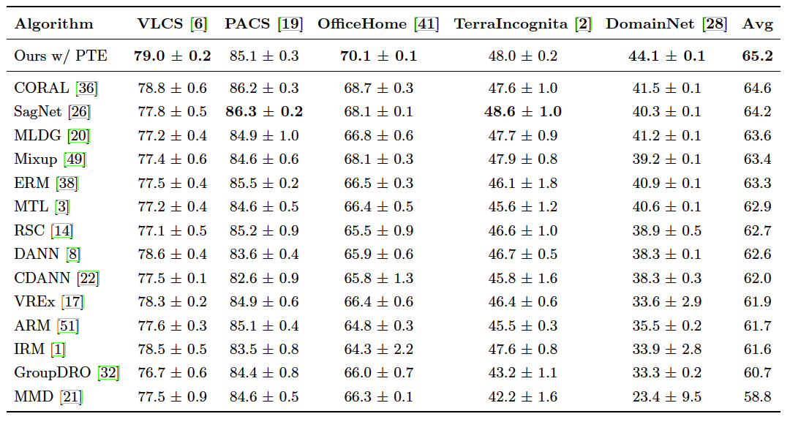

# Large-Scale Experiments on DomainBed
We modified the DomainBed repo to incorporate natural language supervision. \
For more information, please see the <a href="https://github.com/facebookresearch/DomainBed">original repo</a>.


## Datasets
The list of available datasets with natural language supervision
* VLCS  ([Fang et al., 2013](https://openaccess.thecvf.com/content_iccv_2013/papers/Fang_Unbiased_Metric_Learning_2013_ICCV_paper.pdf))
* PACS ([Li et al., 2017](https://arxiv.org/abs/1710.03077))
* Office-Home ([Venkateswara et al., 2017](https://arxiv.org/abs/1706.07522))
* A TerraIncognita ([Beery et al., 2018](https://arxiv.org/abs/1807.04975)) subset
* DomainNet ([Peng et al., 2019](http://ai.bu.edu/M3SDA/))

Download the datasets:
```sh
python3 -m domainbed.scripts.download --data_dir=data
```

For natural language supervision, we use *Per-Class* definitions from Oxford English Dictionary. \
Download the zipped file and place the **texts** directories into the corresponding datasets (<a href="https://drive.google.com/file/d/1mSKPOjcTIfykX_CywQe5dIX4ZXdg7zdS/view?usp=sharing">Download Link</a>).


## Quick Start
Train a model:
```sh
python3 -m domainbed.scripts.train \
       --data_dir=data \
       --algorithm GVRT \
       --dataset VLCS \
       --test_env 0
```

Launch a sweep:
```sh
python -m domainbed.scripts.sweep launch \
       --data_dir=data \
       --output_dir=results \
       --command_launcher MyLauncher\
       --algorithms GVRT \
       --datasets VLCS PACS OfficeHome TerraIncognita DomainNet \
       --n_hparams 20 \
       --n_trials 3
```

To view the results of your sweep:

````sh
python -m domainbed.scripts.collect_results --input_dir=results
````


## Experimental Results on DomainBed
We report averaged results across three independent runs.


